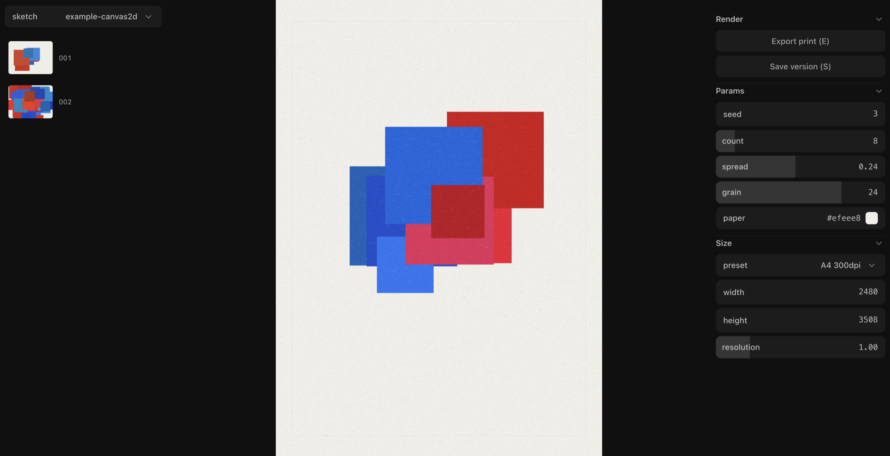

# gen-studio

A small, hackable environment for generative art. 



```bash
pnpm install
pnpm dev
```

## Principles

- **A sketch is a folder.** `sketches/<name>/` holds the code, its versions and its exports. You can `ls` it, `cp -r` it, zip it, delete it. No project file, no database, no hidden state.
- **Small enough to read.** `core/` is ~2.7k lines of plain TypeScript in one Vite process, on two dependencies: [p5](https://p5js.org) for the renderer and [dialkit](https://github.com/joshpuckett/dialkit) for the params panel. If something bothers you, open the file. 
- **Customization is a code change.** There is no settings panel. Want JPEG exports, a different filename scheme, a bleed guide? That's a small edit, and the codebase is small enough that editing it is safe.
- **Skills over features.** GIF export, three.js, shaders and tiled prints are not in core. They live in `.agents/skills/add-*` — recipes your coding agent follows to drop one module into `plugins/`. Say "add GIF export" and it happens.

## The sketch folder

```
sketches/poster/
├── sketch.js          ← your code (or index.js / .ts). The only file you write by hand.
├── versions/          ← saved parameter sets, committed
│   ├── 001/
│   │   ├── params.json
│   │   └── thumb.png
│   └── 002/…
└── exports/           ← rendered files + sidecars, gitignored
    ├── poster.2026.09.02-14.30.05.007.png
    └── poster.2026.09.02-14.30.05.007.json
```

## Examples 

| | |
|---|---|
| `example-canvas2d` | A4 print, on-screen-only guide |
| `example-loop` | Instagram-post animation, exports as MP4 |
| `example-p5-webgl` | p5 in WEBGL mode |
| `example-plotter` | returns an SVG on export ([Layers](#layers-returning-files-from-draw)) |

## Writing a sketch

`sketch.js` is a plain ES module. The host reads a few optional exports and one required one, `draw`.

### Canvas 2D

```js
// sketches/poster/sketch.js
export const config = { size: { preset: 'A4 300dpi' } };

export const params = {
  seed: 1,
  count: { value: 18, min: 3, max: 48, step: 1 }, // slider
  ink: '#1c1612',                                  // color picker
};

export function draw(c, t, { width: w, height: h, random }) {
  c.fillStyle = '#f4f1e8';
  c.fillRect(0, 0, w, h);

  c.fillStyle = params.ink;
  for (let i = 0; i < params.count; i++) {
    c.beginPath();
    c.arc(random(w * 0.1, w * 0.9), random(0, h), w * random(0.005, 0.02), 0, 2 * Math.PI);
    c.fill();
  }
}
```

`c` is a `CanvasRenderingContext2D`.

### p5

Set `config.renderer` and `p` becomes a p5 instance in instance mode — call everything as `p.x`:

```js
// sketches/orbit/sketch.js
export const config = {
  renderer: 'p5',                  // or 'p5-webgl'
  size: { preset: 'Instagram post' },
  fps: 30,
  duration: 4,                     // fps + duration = animation, exports as MP4
};

export const params = { seed: 1, dots: { value: 40, min: 5, max: 200, step: 1 } };

export function draw(p, t, { width: w, height: h }) {
  p.background('#2c62c8');
  p.noStroke();
  p.fill(255);
  for (let i = 0; i < params.dots; i++) {
    const a = (i / params.dots + t) * p.TWO_PI;   // t goes 0→1 over the loop
    p.circle(w / 2 + p.cos(a) * w * 0.35, h / 2 + p.sin(a) * w * 0.35, w * 0.01);
  }
}
```

### Lifecycle and `api`

```js
export async function load(p, api) { /* await fonts, images */ }
export function setup(p, api)      { /* one-time init */ }
export function draw(p, t, api)    { /* every frame; required */ }
export function dispose(p, api)    { /* free listeners, GL resources */ }
```

`api` gives you:

| | |
|---|---|
| `random(min?, max?)`, `noise(x, y?, z?)`, `seed` | seeded randomness |
| `frame`, `frames`, `fps`, `time` | where you are in the loop (`time` is `frame / fps`) |
| `width`, `height` | design pixels |
| `scale` | device px per design px; the host already applied it |
| `tile` | the window of the artwork this canvas shows ([Big prints](#big-prints)) |
| `exporting` | true while rendering to a file — hide guides with it |

Changing the size reruns `load` and `setup`. If `draw` throws, the error goes to the status bar and the loop keeps running. So does a syntax error or a missing `draw`.

`t` runs from 0 toward 1 across the loop and never reaches it, so the last frame is not a copy of the first and `sin(t * 2π)` wraps seamlessly.

`api.random()` is reseeded with `seed` before **every** frame, so a layout drawn from it holds still while `t` animates. Want a fresh draw per frame? Call `api.randomSeed(api.seed + api.frame)` at the top of `draw`.

### Three rules for preview = export

1. **Draw in `api.width` × `api.height`.** Never read `canvas.width`, never multiply by a scale factor.
2. **Randomness from `api.random()` / `api.noise()`.** Not `Math.random()`.
3. **Time from `t` / `api.frame`.** Not `Date.now()`, `millis()` or `frameCount`.

### Interaction

The stage redraws whenever you touch it, so a sketch can react to the mouse, the keyboard, a MIDI knob or a microphone.

One rule makes that reach the file: **the export receives no input — it only re-runs `draw`.** So an input's job is to become data that `draw` reads. Use `params` for a decision you want to keep; a plain variable is enough for a hover.

```js
export const params = { seed: 1, x: 0.5, y: 0.5 };   // where you last clicked, as a fraction

export function setup(p, api) {                      // canvas2d: c.canvas.addEventListener
  p.mousePressed = () => {
    params.x = +(p.mouseX / p.width).toFixed(3);     // p5's mouse is canvas pixels
    params.y = +(p.mouseY / p.height).toFixed(3);
  };
}

export function draw(p, t, api) {
  p.circle(params.x * api.width, params.y * api.height, api.width * 0.05);
}
```

Click, and `params.x/y` change, the stage redraws, the panel catches up when you release. Drag those sliders and the circle moves too. `E` exports the circle where you clicked; `S` saves it; a version brings it back.

| The input writes to | Export shows it | In the sidecar | `S` saves it |
|---|---|---|---|
| `params` | yes | yes | yes |
| a module variable | yes — same module | no | no |
| a p5 built-in (`mouseX`, the `orbitControl()` camera) | yes — snapshotted at `E` | as `view` | no |

The patterns follow from the rule:

- Click to place things → `params.sites = [[x, y], …]`. An array is a fine param; the panel skips it, versions keep it.
- Drag or wheel as a knob → a numeric param.
- A live signal → sample it into a variable on screen, and replay a per-frame recording by `api.frame` for animations.
- Anything that must stay out of the file → draw it under `if (!api.exporting)`.

The export runs in a hidden instance nobody is touching, so your mouse cannot leak into a video.

## Params

Every key in `params` becomes a control. The hints live next to the value:

```js
export const params = {
  seed: 1,                                              // number input
  count: { value: 18, min: 3, max: 48 },                // slider; integer bounds ⇒ integer steps
  amount: { value: 0.3, min: 0, max: 1, step: 0.01 },   // slider with an explicit step
  mode:  { value: 'top', options: ['top', 'bottom'] },  // dropdown
  ink:   '#1c1612',                                     // color picker
  guide: true,                                          // checkbox
};
```

The host flattens the descriptors at load, so your code always reads `params.count` as a plain value. Dragging a slider writes into `params` and re-renders.

`seed` is ordinary except that `R` gives it a new random value — the fastest way to see another one.

Too heavy to re-render on every edit? Set `config.autoRender = false`. Edits then wait for the **Render** button or `Enter`.

The panel is [dialkit](https://github.com/joshpuckett/dialkit). A plugin can wrap one of its controls, or render its own DOM, and select it with `type:` in the hint — see [Extending](#extending).

## Size

Sizes are pixels. The **Size** folder has a preset dropdown plus `width`, `height`, `resolution`.

- `width × height` are the design pixels your code draws in.
- `resolution` multiplies the output. `2` gives a @2x file of the same picture; `0.5` a quick draft.
- Presets cover print at 300 dpi (`A5`–`A1`, `Letter`, `Tabloid`, `18x24in`, `24x36in`) and social (`Instagram post/portrait/story`, `TikTok`, `YouTube`, `YouTube short`, `X post`, `4K`).

The code is the source of truth: `config.size` if you set it, otherwise 1080 × 1080. Changing the size in the panel is for trying things out and lasts until you reload. Once you like a size, put it in `config.size`. Saved versions remember the size they were saved at.

## Versions

`S` (or **Save**) writes `params.json` + `thumb.png` to `sketches/<name>/versions/NNN/`. Click a thumbnail to load it back — params and size both. Delete the folder to delete the version.

## Export

`E` (or **Export**). Animated sketches produce an MP4, everything else a PNG. `Escape` cancels. Both files land in `sketches/<name>/exports/`:

```
poster.2026.09.02-14.30.05.007.png   ← the artifact
poster.2026.09.02-14.30.05.007.json  ← params (incl. seed), size, pixels, preset, fps, duration
```

The sidecar makes every export reproducible: same params, same seed, same size ⇒ same pixels.

Video frames stream straight into `ffmpeg`, which needs to be on your PATH or at `FFMPEG_PATH`.

## Extending

There is no plugin store and no settings panel. To add an exporter, renderer, size preset, param widget, keybinding or `/api` route, you (or your coding agent) write a small module in `plugins/`.

Common ones ship as skills in `.agents/skills/add-*`: `add-gif-export`, `add-three`, `add-shader`, `add-hot-reload`, `add-tiled-export`, `add-cli-export`.

The contracts, registries and examples live in [`AGENTS.md`](AGENTS.md). It's written for coding agents, but it doubles as the extension docs for humans.

Deliberately not in core: GIF, JPEG/WebP, batch and command-line export, hot reload that preserves params, mm/cm/dpi calculators, tiled rendering, MIDI, three.js.

## Commands

```bash
pnpm dev      # the app: Vite dev server + the /api middleware
pnpm check    # typecheck
pnpm test     # vitest on the pure modules in core/
pnpm verify   # typecheck, then test
```

## Inspiration

The way this repo is organised — small enough to read in an afternoon, customised by editing code rather than configuring it, extended by copying modules in rather than shipping features everyone pays for — comes from [NanoClaw](https://github.com/nanocoai/nanoclaw).

## License

MIT
